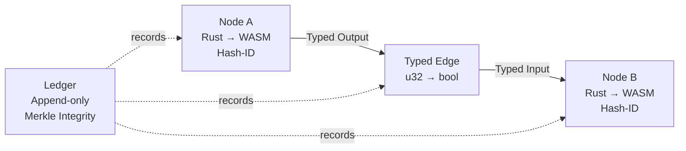
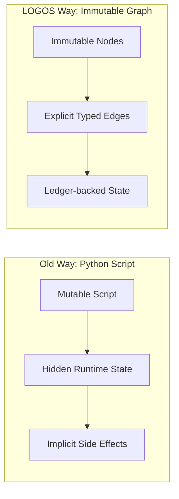

# LOGOS
## A Graph-Based Coordination Protocol for Deterministic AI Execution
### A Governance-First Architecture for Sandboxed, Immutable, AI-Generated Logic

---

## Abstract

Modern AI systems are increasingly capable of generating executable code, yet the surrounding infrastructure remains fundamentally permissive, mutable, and hostile to long-lived correctness. This gap creates a critical failure mode: untrusted AI agents are allowed to introduce opaque, irreversible logic into production environments with insufficient architectural constraints.

LOGOS proposes a different foundation. Rather than treating AI-generated code as text artifacts or runtime scripts, LOGOS defines a **graph-based coordination protocol** in which executable logic exists solely as immutable, sandboxed WebAssembly nodes governed by a strict dataflow graph and an append-only governance ledger.

In LOGOS, architecture—not runtime behavior—is the primary enforcement mechanism. All computation is expressed as atomic Rust payloads compiled to WASM, all coordination is encoded as typed graph edges, and all evolution occurs through explicit, auditable migrations rather than in-place modification.

This paper presents LOGOS as a governance-first execution substrate for deterministic AI systems. We define its threat model, invariants, and trust assumptions; describe its database-backed graph architecture; and demonstrate its applicability through a canonical financial transaction approval system. LOGOS is not a programming language, scheduler, or agent framework. It is a protocol designed to constrain AI systems by construction, enabling autonomy without surrendering control.

---

## 1. Introduction
### The Failure Mode of Permissive AI Execution

AI systems have crossed a critical threshold: they no longer merely suggest code but increasingly generate, modify, and execute it. However, the infrastructure surrounding AI execution has not evolved accordingly. Most systems still treat AI-generated code as mutable text, executed in permissive runtimes governed primarily by convention, tests, and human review.

Runtime flexibility, while productive for human developers, becomes a liability when applied to untrusted AI agents. Hallucinated logic, silent behavioral drift, and untraceable side effects accumulate over time, eroding system integrity.

LOGOS is designed to address this failure mode by constraining AI systems at the architectural level rather than attempting to correct behavior post hoc.

---

## 2. Design Goals and Non-Goals
### What LOGOS Is — and Explicitly Is Not

### 2.1 Design Goals

- Deterministic execution
- Immutability by construction
- Auditability as a first-class property
- Governance before intelligence
- Safe, bounded autonomy

### 2.2 Explicit Non-Goals

LOGOS is explicitly **not**:

- A programming language (it uses Rust; it does not replace it)
- A general-purpose scheduler
- A no-code or low-code platform
- An AI alignment or ethics framework

LOGOS enforces **security and correctness constraints**, not moral values.

---

## 3. Threat and Trust Model
### Assumptions for Adversarial AI Systems

- AI agents are **untrusted by default**
- The LOGOS Supervisor is the **trusted root**
- Human intervention is **emergency-only**, via Migration Tokens
- Primary attacker model:
  - Malicious or hallucinating AI agents
  - Unauthorized capability escalation
  - Logic substitution through mutation

LOGOS does not assume Byzantine supervisors or compromised cryptography.

---

## 4. System Overview
### LOGOS as a Coordination Protocol

LOGOS is a **coordination protocol**, not an orchestration framework.

Orchestration decides *when* and *where* tasks run.
Coordination defines *what is allowed to exist* and *how components may interact*.

In LOGOS, the graph itself is the system.

---

## Figure 1. LOGOS Core Architecture

*Figure 1. Immutable computation nodes are coordinated through typed edges and governed by an append-only ledger.*

## 5. Core Architecture: The Graph Substrate
LOGOS is built on a database-backed graph composed of Nodes, Edges, and a Ledger.

### 5.1 Nodes: Immutable Logic Artifacts
A Node represents an atomic unit of computation:

- Written in Rust
- Compiled to WASM (WASI)
- Identified by the cryptographic hash of its compiled binary

Nodes are practically immutable:

- Never modified in place
- Deprecated or forked via explicit migration
- All changes produce new identities

### 5.2 Edges: Typed Dataflow Contracts
An Edge defines an explicit dataflow contract between nodes:

- Enforced compile-time type compatibility
- No implicit coercion
- No side-channel communication

Edges carry not only typed data, but also explicit state context across the graph lifecycle, enabling durable execution and replay independent of node memory.

State is therefore:

- Not stored in node RAM
- Not hidden in runtime
- Explicitly represented in graph transitions

### 5.3 Ledger: Append-Only Governance Log
The Ledger is an append-only, Merkle-style log that records:

- Node creation and hashing
- Edge creation and removal
- Capability grants
- Deprecations and migrations
- Ownership and locking events

The ledger enables replay, audit, and forensic analysis without global consensus.

### 5.4 Capabilities and IO
LOGOS adopts interface-based security via WASI:

- All IO is capability-gated
- Capabilities are granted explicitly per node
- No ambient authority

Examples include:

- Network access
- Time access
- Randomness
- External storage

A node cannot request capabilities it was not explicitly granted.

## 6. Execution Model
### From Prompt to Deterministic Computation
1. A human issues high-level intent
2. An AI agent generates a Rust payload
3. The payload is inserted in Draft Mode
4. The Supervisor compiles and verifies it
5. The node becomes available in one of two layers:
   - **Sediment Layer** — a mutable sandbox for autonomous AI iteration under constrained capabilities
   - **Bedrock Layer** — a locked, immutable execution layer for human-verified logic governed by strict migration rules

Execution without human approval is permitted only within explicitly sandboxed layers.

## 7. System Invariants
### Properties Enforced by Construction
LOGOS enforces the following invariants:

- Nodes cannot be modified after creation
- All execution paths are explicitly encoded
- All dataflows are typed and declared
- Capabilities are non-transitive
- Architecture changes are auditable events

LOGOS aligns conceptually with Actor Models and State Machines, but differs in that architecture itself is immutable data.

## 8. Canonical Use Case
### Financial Transaction Approval System
In a financial approval system:

- Each validation rule is a node
- Risk scoring is a deterministic subgraph
- Approval thresholds are explicit edges
- Execution is replayable for audit

LOGOS prioritizes correctness under audit over raw latency.

## Figure 2. Execution Model Comparison

*Figure 2. Script-based execution relies on mutable runtime behavior, while LOGOS enforces architecture-defined execution.*

## 9. Comparison with Existing Systems

**Agent Frameworks (e.g., LangChain)**
- Optimize for flexibility
- LOGOS optimizes for constraints

**Durable Execution (e.g., Temporal)**
- Code-defined workflows
- LOGOS provides data-defined architecture

**Smart Contracts (EVM)**
- Global consensus, high latency
- LOGOS uses federated governance optimized for auditability

LOGOS is not a blockchain competitor. It is an execution substrate.

## 10. Licensing and Political Positioning
### AGPL as an Anti-Cloud-Capture Mechanism
LOGOS is licensed under AGPL-3.0 to prevent silent enclosure of governance infrastructure.

If execution is governed, governance must remain public.

## 11. Limitations and Future Work
- High adoption friction
- Requires disciplined engineering culture
- Dependent on improving AI code generation

Future directions:

- Formal verification
- Multi-supervisor federation
- Hardware-enforced capability mapping

## 12. Conclusion
### Autonomy Requires Architecture, Not Trust
As AI systems gain autonomy, trust-based execution models collapse. LOGOS demonstrates a different path: constrain systems by construction, encode governance as data, and treat execution as a privilege rather than a default.

LOGOS does not promise intelligence.
It promises boundaries.
